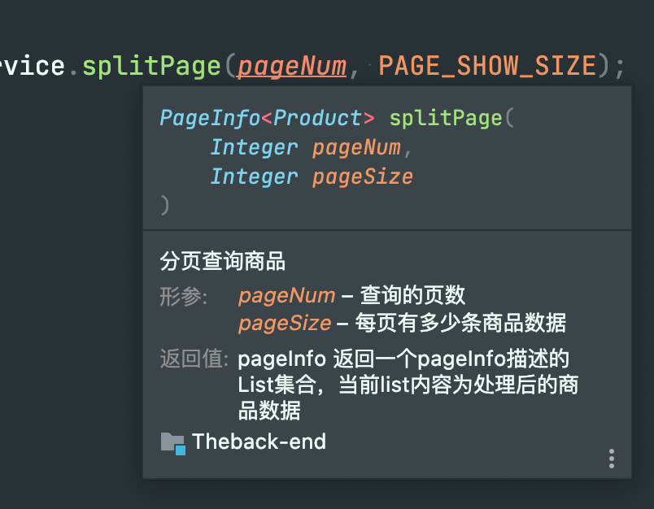

#	基于springboot 及 前端技术（待更新）的奶茶店管理下单系统

---

> ### 后端：
>
> * 开发IDE：IntelliJ IDEA 2021.3 (Ultimate Edition)
> * JDK：11.0.13+7-b1751.19 x86_64
> * 技术栈：
>   * SpringBoot 2.5.5
>   * Mybatis-Spring-Boot-Starter 2.2.0
>   * 
> * 插件：
>   * pageHelper
>   * alibaba druid
> * 规范约束：
>   * alibaba encoding 编码规约Idea插件插件 	上传前请勾选优化导入
>   * 接口需完成对应文档注释，使用前请参阅方法说明
>     * 
>     * 
>
> ### 前端：
>
> * 开发IDE：
> * 技术栈：
>   * 
> * 插件：
>   * 

---

本次实训进行过程中，README.md 暂作开发文档作用

>
>
>* 2021年12月21日 (项目组成员git 操作熟悉)
>* [**GnaixEuy**](https://github.com/GnaixEuy)
>* [**OkeyTurkey**](https://github.com/OkeyTurkey)
>* [**Utah-syp**](https://github.com/Utah-syp)
>* [**LSyv-ing**](https://github.com/LSyv-ing)

